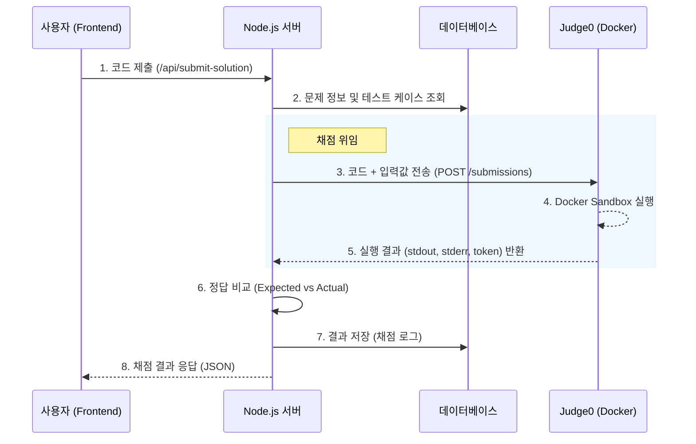

# Judge0 도입 타당성 평가 및 통합 계획 보고서

## 1. 타당성 평가 (Evaluation)

**결론: 매우 적합함 (Highly Recommended)**

제시된 옵션 중 **Judge0**가 `educodingnplay` 프로젝트의 현재 기술 스택(Node.js/Express, Python 교육)과 요구사항(보안, 확장성, 유지보수)에 가장 부합합니다.

### 주요 근거:
1.  **보안성 (Security)**: 현재 로컬에서 `child_process` 등으로 사용자 코드를 실행하는 방식은 무한 루프나 시스템 명령 실행(`rm -rf` 등)에 취약합니다. Judge0는 Docker 기반의 Sandbox 환경에서 코드를 실행하므로, 메인 서버를 안전하게 격리할 수 있습니다.
2.  **기술 스택 호환성**: Judge0는 REST API를 제공하므로, 현재의 Express 백엔드에서 `axios`나 `fetch`를 통해 함수 호출하듯 쉽게 붙일 수 있습니다. 언어 의존성이 없어 Node.js 백엔드와 완벽하게 분리됩니다.
3.  **IO 및 함수형 채점 지원**:
    *   **IO 문제**: Standard Input/Output 채점을 기본 지원하며, 입력값을 API 파라미터로 넘기고 `stdout`을 받아 비교하기 쉽습니다.
    *   **함수형(Solution) 문제**: Python 스크립트에서 테스트 코드를 포함하여 전송하면, 결과를 파싱하기만 하면 되므로 유연합니다.
4.  **설치 및 관리**: Docker Compose를 이용해 로컬 개발 환경 및 배포 환경에 즉시 구축이 가능합니다.

---

## 2. Judge0 통합 시 작업 흐름 (Workflow Integration)

Judge0를 도입하면 "로컬 실행(Local Execution)"에서 "위임 실행(Delegated Execution)"으로 아키텍처가 변경됩니다.

### 2.1 아키텍처 변화
*   **AS-IS (현재)**:
    *   Web Server (Node.js)가 직접 Python 프로세스를 생성(`spawn`)하여 실행.
    *   서버 리소스(CPU/Memory)를 사용자 코드가 직접 점유. 위험함.
*   **TO-BE (변경 후)**:
    *   **Web Server (Node.js)**: API Gateway 역할. 사용자 요청을 받아 인증/데이터 조회 후 Judge0로 전달.
    *   **Judge0 Server (Docker)**: 실제 코드 실행을 전담. 결과만 반환.

### 2.2 시스템 구성도 (Mermaid)

### 2.3 상세 구현 단계

Judge0 도입을 위해 다음과 같은 작업이 필요합니다.

#### 단계 1: 인프라 구축 (Infrastructure)
1.  프로젝트 루트(또는 별도 서버)에 `docker-compose.yml` 파일을 생성하여 Judge0 서비스(DB, Redis, Worker)를 정의합니다.
2.  서비스를 실행하여 내부망(예: `http://localhost:2358`)에서 API가 동작하는지 확인합니다.

#### 단계 2: 백엔드 어댑터 구현 (Backend Adapter)
1.  기존 `PythonRunner` 클래스를 리팩토링하여 로컬 실행 로직(`spawn`)을 제거합니다.
2.  대신 `axios`를 사용하여 Judge0 API(`POST /submissions/batch`)를 호출하는 로직으로 대체합니다.
3.  **배치 채점(Batch Processing)**: 여러 테스트 케이스를 한 번에 Judge0로 보내 병렬로 처리하거나, 순차적으로 처리하는 로직을 구현합니다.

#### 단계 3: 채점 로직 고도화
1.  **IO 문제 (`io`)**:
    *   Judge0의 `stdin` 필드에 테스트 케이스 Input을 넣습니다.
    *   응답받은 `stdout`과 DB의 `expected_output`을 문자열 비교(Trim 처리)합니다.
2.  **함수형 문제 (`function.solution`)**:
    *   사용자가 작성한 `solution` 함수 뒤에, 우리가 준비한 테스트 실행 코드(Driver Code)를 덧붙여서 Judge0로 보냅니다.
    *   예: `user_code` + `\nprint(solution(test_input))`

## 3. 결론

챗GPT가 제안한 **Judge0**는 현재 프로젝트에 가장 적합한 솔루션입니다.
이를 적용하면 **보안 이슈를 단번에 해결**하고, **Node.js 서버의 부하를 분산**시킬 수 있어 안정적인 서비스 운영이 가능해집니다.

**바로 진행하시겠습니까?** 진행 시 `docker-compose.yml` 설정부터 안내해 드리겠습니다.
