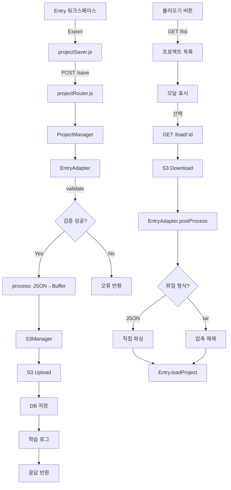

# 📘 Entry 프로젝트 저장/불러오기/제출 통합 시스템 명세서

**작성일**: 2025년 11월 21일  
**버전**: 1.0  
**작성자**: AI Assistant & doopyo

---

## 🎯 개요

educodingnplay 플랫폼의 Entry(엔트리) 프로젝트 관리를 위한 **통합 저장/불러오기 시스템**입니다.

### 주요 특징

1. ✅ **통합 아키텍처**: ProjectManager + EntryAdapter 패턴
2. ✅ **S3 Browser 연동**: 동일한 경로 체계 (`users/{userID}/entry/`)
3. ✅ **3가지 저장 타입**: draft(임시저장), final(제출), autosave(자동저장)
4. ✅ **DB + S3 이중 저장**: 메타데이터(DB) + 실제 파일(S3)
5. ✅ **자동 파일명 생성**: 프로젝트명_사용자명_날짜
6. ✅ **tar/JSON 이중 포맷 지원**: 압축된 ENT 파일 및 순수 JSON 모두 처리

---

## 📂 시스템 구조

```
┌─────────────────────────────────────────────────────────┐
│              Entry 프로젝트 관리 시스템                  │
├─────────────────────────────────────────────────────────┤
│                                                         │
│  ┌──────────────┐      ┌──────────────┐               │
│  │   클라이언트  │      │    서버      │                │
│  │              │      │              │                │
│  │ projectSaver │◄────►│ ProjectManager│               │
│  │   .js        │ API  │               │               │
│  │              │      │  EntryAdapter │               │
│  └──────────────┘      └──────┬────────┘               │
│         ▲                     │                        │
│         │                     ▼                        │
│    Entry.js              ┌────────┐                    │
│   (8070 포트)            │   S3   │                    │
│                          │ Storage│                    │
│                          └────────┘                    │
│                               ▲                        │
│                               │                        │
│                          ┌────┴────┐                   │
│                          │  MySQL  │                   │
│                          │   DB    │                   │
│                          └─────────┘                   │
└─────────────────────────────────────────────────────────┘
```

---

## 🗂️ 파일 구조

### 📁 서버 사이드

```
educodingnplay/
├── lib_project/
│   ├── ProjectManager.js              # 🔥 통합 프로젝트 관리자
│   ├── adapters/
│   │   ├── BaseAdapter.js             # 어댑터 기본 클래스
│   │   └── EntryAdapter.js            # 🔥 Entry 전용 어댑터
│   └── README.md
├── lib_storage/
│   └── s3Manager.js                   # S3 업로드/다운로드
├── routes/api/
│   └── projectRouter.js               # 🔥 통합 프로젝트 API
└── lib_login/
    └── db.js                           # MySQL 연결
```

### 📁 클라이언트 사이드

```
entry/
└── js/
    └── projectSaver.js                 # 🔥 Entry 저장/불러오기 UI
```

---

## 🔄 데이터 흐름

### 1️⃣ 저장 흐름 (Save)

```
Entry 워크스페이스
    ↓
Entry.exportProject()  (프로젝트 JSON 추출)
    ↓
projectSaver.saveProject()  (클라이언트)
    ↓
POST /api/projects/save  (서버)
    ↓
ProjectManager.saveProject()
    ↓
EntryAdapter.validate()  (검증)
    ↓
EntryAdapter.process()  (JSON → Buffer 변환)
    ↓
S3Manager.uploadProject()  (S3 업로드)
    ↓
ProjectManager.saveToDatabase()  (DB 저장)
    ↓
ProjectManager.logLearningActivity()  (학습 로그)
    ↓
응답: { success: true, submissionId, s3Url, s3Key }
```

### 2️⃣ 불러오기 흐름 (Load)

```
사용자가 "불러오기" 버튼 클릭
    ↓
projectSaver.showLoadProjectModal()  (프로젝트 목록 표시)
    ↓
GET /api/projects/list?platform=entry  (목록 조회)
    ↓
사용자가 특정 프로젝트 선택
    ↓
GET /api/projects/load/{projectId}  (서버)
    ↓
ProjectManager.loadProject()
    ↓
S3Manager.downloadProject()  (S3에서 다운로드)
    ↓
EntryAdapter.postProcess()  (Buffer → JSON 변환)
    ├─ JSON 파일인 경우: 직접 파싱
    └─ tar 압축 파일인 경우: 압축 해제 후 project.json 추출
    ↓
응답: { success: true, projectData, metadata, projectInfo }
    ↓
Entry.loadProject(projectData)  (Entry 워크스페이스에 로드)
    ↓
projectSaver.setProjectName()  (프로젝트명 자동 설정)
```

### 3️⃣ 제출 흐름 (Submit)

```
사용자가 "제출하기" 버튼 클릭
    ↓
confirm() 확인 대화상자
    ↓
projectSaver.submitProject()  (자동 파일명 생성)
    ↓
POST /api/projects/submit  (서버)
    ↓
ProjectManager.saveProject() { saveType: 'final' }
    ↓
(저장 흐름과 동일)
    ↓
제출 완료 알림
```

---

## 💾 S3 저장 구조

### 경로 체계

```
s3://educodingnplaycontents/
└── users/
    └── {userID}/
        └── entry/
            ├── draft/              # 임시 저장
            │   ├── project1_1732156789123.ent
            │   └── project2_1732156790456.ent
            ├── final/              # 최종 제출
            │   ├── cpe1-1a_forena_20251121.ent
            │   └── cpe1-2b_forena_20251121.ent
            └── autosave/           # 자동 저장 (예정)
                └── auto_1732156791789.ent
```

### 파일명 규칙

**형식**: `{projectName}_{timestamp}.ent`

- **임시 저장 (draft)**: 사용자가 입력한 이름 (기본값: 자동생성)
- **최종 제출 (final)**: `{프로젝트명}_{사용자명}_{날짜}`
  - 예: `cpe1-1a_forena_20251121.ent`

### S3 Browser와의 통합

**동일한 경로 체계 사용**:
- S3 Browser: `users/{userID}/`로 시작
- 프로젝트 시스템: `users/{userID}/entry/`로 시작

→ **완벽히 호환됨!** S3 Browser에서도 Entry 프로젝트 파일 확인 가능

---

## 🗄️ 데이터베이스 구조

### ProjectSubmissions 테이블

```sql
CREATE TABLE ProjectSubmissions (
    id INT AUTO_INCREMENT PRIMARY KEY,
    user_id INT NOT NULL,                    -- Users.id (숫자)
    center_id INT,                           -- 센터 ID
    platform VARCHAR(50) NOT NULL,           -- 'entry', 'scratch', 'appinventor'
    project_name VARCHAR(255) NOT NULL,      -- 프로젝트명
    save_type ENUM('draft', 'final', 'autosave') DEFAULT 'draft',
    
    s3_url VARCHAR(500) NOT NULL,            -- S3 전체 URL
    s3_key VARCHAR(500) NOT NULL,            -- S3 키 (경로)
    file_size_kb INT,                        -- 파일 크기 (KB)
    
    metadata TEXT,                           -- JSON 형식 메타데이터
    complexity_score DECIMAL(5,2),           -- 복잡도 점수 (1-5)
    blocks_count INT,                        -- 블록 개수
    
    created_at TIMESTAMP DEFAULT CURRENT_TIMESTAMP,
    updated_at TIMESTAMP DEFAULT CURRENT_TIMESTAMP ON UPDATE CURRENT_TIMESTAMP,
    
    INDEX idx_user_platform (user_id, platform),
    INDEX idx_save_type (save_type),
    INDEX idx_created (created_at)
);
```

### LearningLogs 테이블

```sql
CREATE TABLE LearningLogs (
    learning_id INT AUTO_INCREMENT PRIMARY KEY,
    user_id INT NOT NULL,
    center_id INT,
    content_type VARCHAR(50),         -- 'entry', 'scratch' 등
    content_name VARCHAR(255),        -- 'entry_draft', 'entry_final' 등
    start_time TIMESTAMP,
    end_time TIMESTAMP,
    duration INT,                     -- 초 단위
    project_id VARCHAR(100),          -- ProjectSubmissions.id
    
    INDEX idx_user (user_id),
    INDEX idx_project (project_id)
);
```

---

## 🔧 핵심 API

### 1. 프로젝트 저장 API

```http
POST /api/projects/save
Content-Type: application/json

{
  "platform": "entry",
  "projectName": "my_game",
  "projectData": { ...Entry 프로젝트 JSON... },
  "saveType": "draft"
}
```

**응답**:
```json
{
  "success": true,
  "submissionId": 123,
  "s3Url": "https://educodingnplaycontents.s3.amazonaws.com/users/forena/entry/draft/my_game_1732156789123.ent",
  "s3Key": "users/forena/entry/draft/my_game_1732156789123.ent",
  "projectName": "my_game",
  "platform": "entry",
  "saveType": "draft",
  "analysis": {
    "complexity": 3,
    "blocks": 45,
    "sprites": 2,
    "variables": 3,
    "functions": 1
  }
}
```

---

### 2. 프로젝트 목록 조회 API

```http
GET /api/projects/list?platform=entry&saveType=draft&limit=50
```

**응답**:
```json
{
  "success": true,
  "projects": [
    {
      "id": 123,
      "platform": "entry",
      "project_name": "my_game_1732156789123",
      "save_type": "draft",
      "s3_url": "https://...",
      "s3_key": "users/forena/entry/draft/my_game_1732156789123.ent",
      "file_size_kb": 124,
      "complexity_score": 3,
      "blocks_count": 45,
      "metadata": "{...}",
      "created_at": "2025-11-21T10:30:00.000Z",
      "updated_at": "2025-11-21T10:30:00.000Z"
    }
  ]
}
```

---

### 3. 프로젝트 불러오기 API

```http
GET /api/projects/load/{projectId}
```

**응답**:
```json
{
  "success": true,
  "projectData": {
    "objects": [...],
    "scenes": [...],
    "variables": [...]
  },
  "metadata": {
    "analysis": {
      "complexity": 3,
      "blocks": 45
    }
  },
  "projectInfo": {
    "id": 123,
    "projectName": "my_game_1732156789123",
    "platform": "entry",
    "saveType": "draft",
    "createdAt": "2025-11-21T10:30:00.000Z"
  }
}
```

---

### 4. 프로젝트 제출 API

```http
POST /api/projects/submit
Content-Type: application/json

{
  "platform": "entry",
  "projectName": "cpe1-1a_forena_20251121",
  "projectData": { ...Entry 프로젝트 JSON... },
  "saveType": "final"
}
```

**응답**: (저장 API와 동일)

---

## 🎨 클라이언트 사용법

### EntryProjectSaver 초기화

```javascript
// Entry 워크스페이스 로드 시 자동 초기화
const saver = new EntryProjectSaver({
  projectName: '내작품',
  userID: 'forena',
  role: 'student'
});

// 전역 변수로 노출
window.entryProjectSaver = saver;
```

---

### 저장 버튼 연결

```javascript
// 임시 저장 버튼
document.getElementById('saveBtn').onclick = async () => {
  try {
    await entryProjectSaver.saveProject();
  } catch (error) {
    console.error('저장 실패:', error);
  }
};

// 제출 버튼
document.getElementById('submitBtn').onclick = async () => {
  try {
    await entryProjectSaver.submitProject();
  } catch (error) {
    console.error('제출 실패:', error);
  }
};

// 불러오기 버튼
document.getElementById('loadBtn').onclick = async () => {
  try {
    await entryProjectSaver.showLoadProjectModal();
  } catch (error) {
    console.error('불러오기 실패:', error);
  }
};
```

---

### 프로젝트명 관리

```javascript
// 프로젝트명 설정 (우선순위)
// 1. 로컬 저장된 프로젝트명
// 2. Entry.State.name
// 3. 기본값 "내작품"

// 프로젝트명 설정
saver.setProjectName('새 게임');

// 현재 프로젝트명 가져오기
const currentName = saver.getCurrentProjectName();

// 파일명에서 프로젝트명 추출
const extracted = saver.extractProjectNameFromFile('cpe1-1a_forena_20251121.ent');
// 결과: "cpe1-1a"
```

---

## 🔐 보안 및 권한

### 사용자 ID 변환

**중요**: 클라이언트는 `userID` (문자열)를 전달하지만, DB는 `user_id` (숫자)를 사용합니다.

```javascript
// ProjectManager.js에서 자동 변환
if (typeof userId === 'string') {
  const [user] = await db.queryDatabase(
    'SELECT id FROM Users WHERE userID = ?',
    [userId]
  );
  numericUserId = user.id;
}
```

### 권한 체크

- **본인 확인**: `WHERE user_id = ?` 조건으로 본인 프로젝트만 접근
- **센터별 그룹핑**: `centerID` 기반 (교사/관리자용 추후 구현)

---

## 🧩 EntryAdapter 상세

### 역할

1. **검증 (validate)**: Entry 프로젝트 데이터 유효성 검사
2. **전처리 (process)**: Entry JSON → Buffer 변환
3. **분석 (analyze)**: 복잡도, 블록 수, 스프라이트 수 계산
4. **후처리 (postProcess)**: S3 Buffer → Entry JSON 복원

---

### 파일 포맷 자동 감지

```javascript
async postProcess(buffer) {
  const firstByte = buffer[0];
  
  // JSON 파일인 경우 ('{' = 0x7B)
  if (firstByte === 0x7B || firstByte === 0x5B) {
    return JSON.parse(buffer.toString('utf-8'));
  }
  
  // tar 압축 파일인 경우
  return await this.extractEntFile(buffer);
}
```

---

### 복잡도 계산

```javascript
calculateComplexity(blocks, variables, functions) {
  let score = 0;
  
  // 블록 수 기준
  if (blocks < 10) score += 1;
  else if (blocks < 30) score += 2;
  else if (blocks < 50) score += 3;
  else if (blocks < 100) score += 4;
  else score += 5;
  
  // 변수/함수 가산점
  if (variables > 0) score += 1;
  if (functions > 0) score += 1;
  
  return Math.min(score, 5);
}
```

---

## 🔧 문제 해결 가이드

### 1. JSON.parse 오류

**증상**: `"[object Object]" is not valid JSON`

**원인**: DB의 `metadata` 컬럼이 이미 객체로 저장됨

**해결**:
```javascript
// ProjectManager.js의 loadProject()에서
let parsedMetadata = {};
if (typeof project.metadata === 'string') {
  parsedMetadata = JSON.parse(project.metadata);
} else if (typeof project.metadata === 'object') {
  parsedMetadata = project.metadata;
}
```

---

### 2. LIMIT 파라미터 오류

**증상**: `Incorrect arguments to mysqld_stmt_execute`

**원인**: MySQL prepared statement에서 LIMIT 플레이스홀더 거부

**해결**:
```javascript
// ❌ 잘못된 방법
query += ` ORDER BY created_at DESC LIMIT ?`;
params.push(limit);

// ✅ 올바른 방법
query += ` ORDER BY created_at DESC LIMIT ${parseInt(limit, 10)}`;
```

---

### 3. S3 경로 불일치

**증상**: S3 Browser에서 파일이 안 보임

**해결**: 경로 체계 통일
```javascript
// ProjectManager.js
generateS3Key(platform, userId, projectName, saveType) {
  return `users/${userId}/${platform}/${saveType}/${projectName}_${timestamp}.${ext}`;
}
```

---

### 4. tar 압축 파일 처리 오류

**증상**: ENT 파일 불러오기 실패

**해결**: EntryAdapter에서 자동 감지
```javascript
// JSON과 tar 모두 처리
async postProcess(buffer) {
  if (buffer[0] === 0x7B) {
    return JSON.parse(buffer.toString('utf-8'));
  }
  return await this.extractEntFile(buffer);
}
```

---

## 🚀 향후 개선 사항

### 1단계: 기본 기능 완성 ✅

- [x] 저장/불러오기/제출 기능
- [x] S3 Browser 통합
- [x] DB 저장 및 조회
- [x] 자동 파일명 생성

### 2단계: 고급 기능

- [ ] **자동 저장 (autosave)**: 5분마다 자동 저장
- [ ] **버전 관리**: 동일 프로젝트의 여러 버전 보관
- [ ] **협업 기능**: 프로젝트 공유 및 협업
- [ ] **썸네일 생성**: 프로젝트 미리보기 이미지

### 3단계: 다른 플랫폼 통합

- [ ] **ScratchAdapter**: Scratch 프로젝트 지원
- [ ] **AppInventorAdapter**: App Inventor 지원
- [ ] **PythonAdapter**: Python 코드 저장

---

## 📊 시스템 흐름도



---

## 📝 체크리스트

### 서버 배포 전 확인사항

- [ ] `.env` 파일에 AWS 자격 증명 설정
- [ ] S3 버킷 권한 확인 (`educodingnplaycontents`)
- [ ] MySQL 테이블 생성 (`ProjectSubmissions`, `LearningLogs`)
- [ ] Redis 서버 실행 확인
- [ ] PM2 프로세스 재시작

### 클라이언트 배포 전 확인사항

- [ ] `projectSaver.js` 파일 포함
- [ ] Entry 워크스페이스에서 `EntryProjectSaver` 초기화
- [ ] 저장/불러오기/제출 버튼 연결
- [ ] 사용자 세션 정보 전달 확인

---

## 🔗 관련 파일 링크

### 서버 코드
- `lib_project/ProjectManager.js`
- `lib_project/adapters/EntryAdapter.js`
- `lib_storage/s3Manager.js`
- `routes/api/projectRouter.js`

### 클라이언트 코드
- `entry/js/projectSaver.js`

### 데이터베이스
- `DB_테이블명세서.txt`
- `CT기반학습관리시스템구축프로젝트명세서.txt`

---

## 📞 문의 및 지원

**개발자**: doopyo  
**프로젝트**: educodingnplay  
**GitHub**: https://github.com/doopyo85/educodingnplay

---

**🎉 이 명세서는 지속적으로 업데이트됩니다!**
